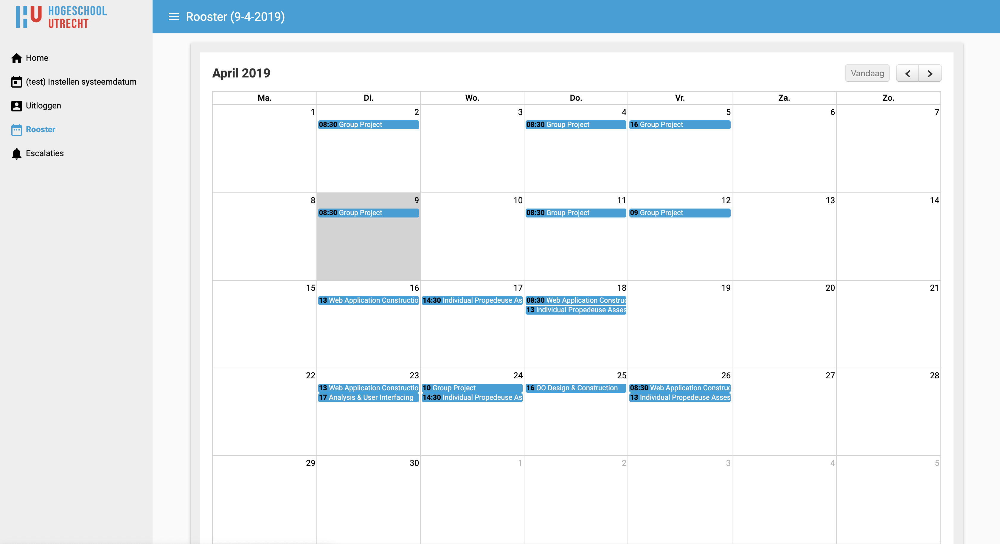

# Group-project_E



Application build in Java and Polymer. This application is used to keep score of student attendance for the Hogeschool Utrecht.

## Run this application

Run `bower install` in the /webapp folder. 

If you see something like this select option `3`
```
Unable to find a suitable version for iron-resizable-behavior, please choose one by typing one of the numbers below:
    1) iron-resizable-behavior#^1.0.3 which resolved to 1.0.6 and is required by fullcalendar-calendar#1.2.2
    2) iron-resizable-behavior#1 - 2 which resolved to 2.1.1 and is required by app-layout#2.1.1, iron-overlay-behavior#2.3.4, iron-pages#2.1.1
    3) iron-resizable-behavior#^v2.0.0 which resolved to 2.1.1 and is required by vaadin-grid#5.3.3
```

After this you will be able run /src/controller/Application.java. 

## credits to:
- Bart den Hamer
- Terry Zhou
- Job Koppenol
- Roan Gaasbeek
- Thomas Berg
- Jamie de Kloet
